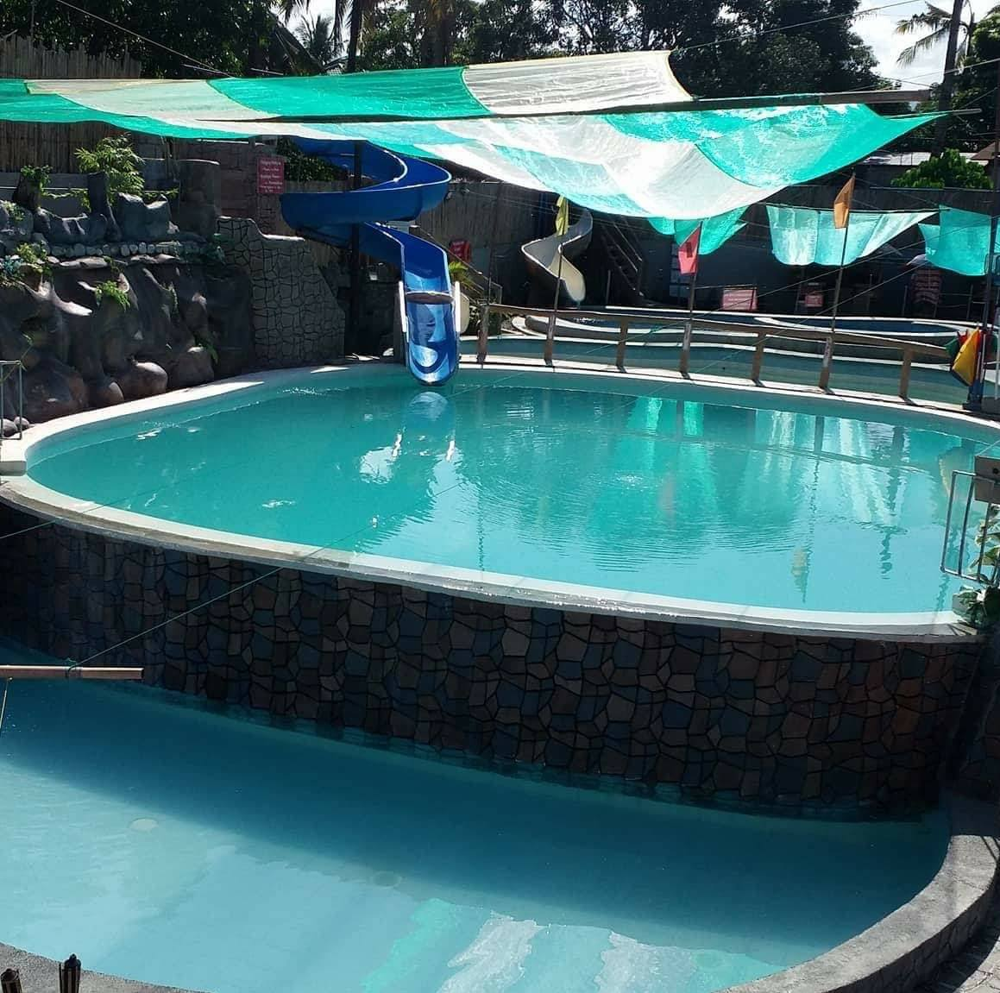
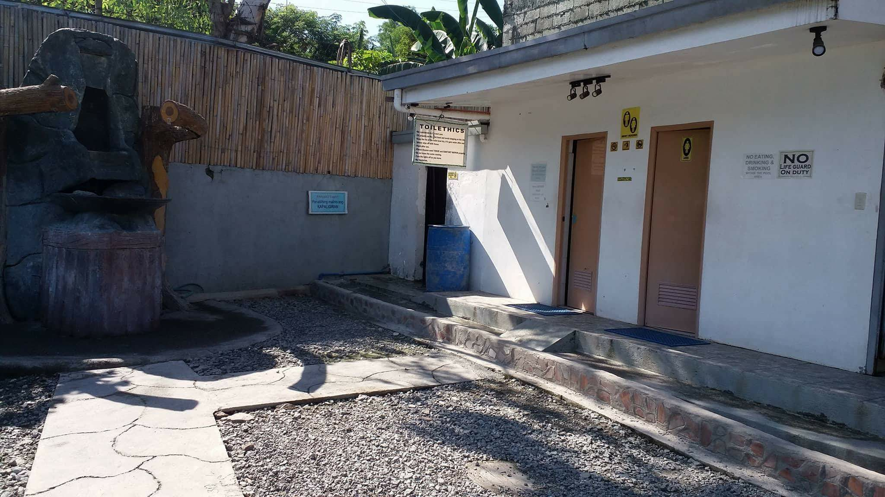

# For Capstone Project Only

<section>
        

            <h2>
                
            </h2>
            <h1>
                
            </h1>
        

        

            <!--Slider Start-->
            

                

                    <!--Radio start-->
                    <input type="radio" name="radio-btn" id="radio1">
                    <input type="radio" name="radio-btn" id="radio2">
                    <input type="radio" name="radio-btn" id="radio3">
                    <input type="radio" name="radio-btn" id="radio4">
                    <input type="radio" name="radio-btn" id="radio5">
                    <!--Radio end-->
                    <!--Sliding start-->
                    

                        
                    

                    

                        
                    

                    

                        
                    

                    

                        
                    

                    

                        
                    

                    <!--Sliding end-->
                    <!--Auto navigation start-->
                    

                        

                        

                        

                        

                        

                    

                    <!--Auto navigation start-->
                

                <!--manual navigation start-->
                

                    <label for="radio1" class="manual-btn"></label>
                    <label for="radio2" class="manual-btn"></label>
                    <label for="radio3" class="manual-btn"></label>
                    <label for="radio4" class="manual-btn"></label>
                    <label for="radio5" class="manual-btn"></label>
                

                <!--manual navigation end-->
            

            <!--Slider End-->

        

    </section>